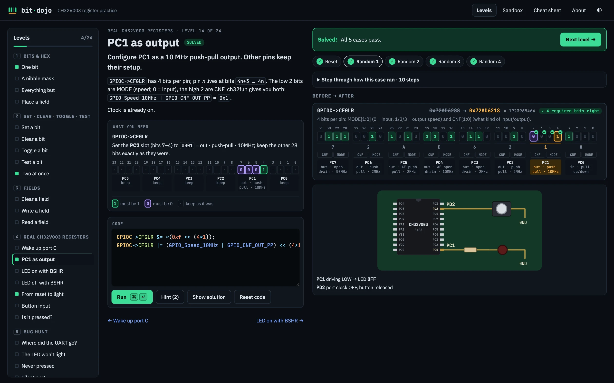
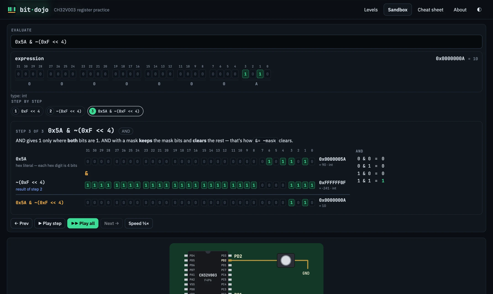
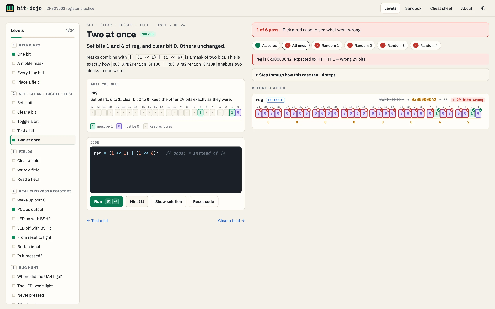
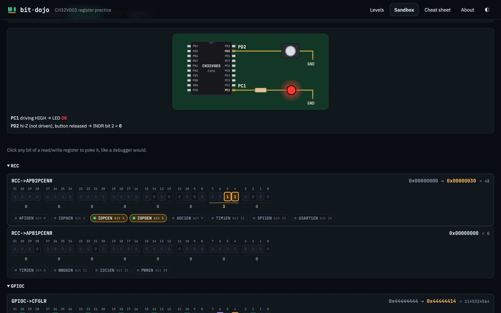
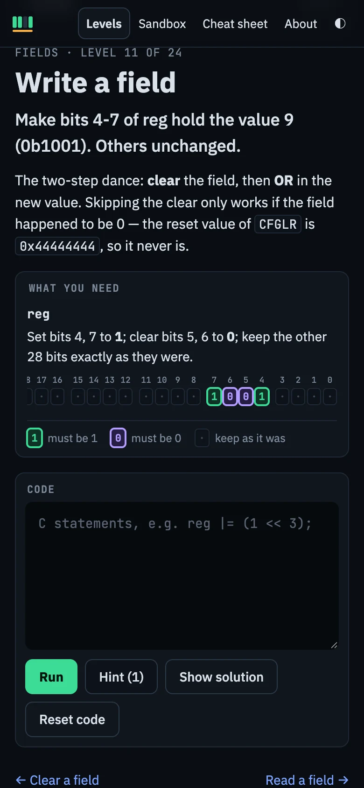

<p align="center"></p>

<h1 align="center">bit-dojo</h1>

<p align="center">
  Learn the bitwise tricks embedded C runs on by writing real register code for a simulated <b>CH32V003</b>.<br>
  <a href="https://utils.elabins.com/bit-dojo/"><b>▶ Play it in your browser</b></a>
</p>

<p align="center">
  <a href="https://utils.elabins.com/bit-dojo/"></a>
  <a href="https://claude.com/claude-code"></a>
  <a href="LICENSE"></a>
</p>

> [!NOTE]
> **🤖 This whole project was vibe-coded with Claude, in September 2026.** The C interpreter, the chip simulator, all 24 levels, the step-by-step visualizer, the tests, the logo and this README were written by [Claude Code](https://claude.com/claude-code). [@e-labInnovations](https://github.com/e-labInnovations) directed it through conversation: the ideas, the feedback, and every "that pin is wrong, look again".

You type C, like `GPIOC->CFGLR |= (GPIO_Speed_10MHz | GPIO_CNF_OUT_PP) << (4*1);`. bit-dojo runs it against the chip model and shows every bit before and after. An LED on PC1 lights up when your code is actually right.

## Screenshots



<table>
  <tr>
    <td width="50%"></td>
    <td width="50%"></td>
  </tr>
  <tr>
    <td align="center"><b>Step-by-step visualizer:</b> every operator animated in binary</td>
    <td align="center"><b>Bit-level grading:</b> <code>=</code> instead of <code>|=</code> wipes 29 bits</td>
  </tr>
  <tr>
    <td></td>
    <td align="center"></td>
  </tr>
  <tr>
    <td align="center"><b>Sandbox:</b> the whole chip, real TSSOP-20 pinout</td>
    <td align="center"><b>Works on phones</b></td>
  </tr>
</table>

## What's inside

- **24 levels in 5 chapters:** bits & hex → set/clear/toggle/test → fields → real CH32V003 registers → bug hunt.
- **Random test cases.** Each level runs your code against several starting states. Code that only works for one lucky value fails, e.g. using `=` where you meant `|=`.
- **A real C subset.** It follows C precedence rules, uses 32-bit `int`/`unsigned` semantics like RV32, handles casts and `if`/`else`. It flags undefined behaviour such as `1 << 31` or a shift count of 32 or more.
- **Hardware behaviour, modelled:**
  - peripherals with their clock off ignore writes and read back 0
  - `BSHR`/`BCR` are write-only set/reset registers
  - `INDR` is read-only
  - reserved bits get dropped
  - `IN_PUPD` inputs use the `OUTDR` bit to pick pull-up or pull-down
  - a button on PD2 pulls the pin to GND
- **"What you need" panel on every level.** It's generated from the level's own checks. The checks are run over about 40 starting states, and each bit is marked as: must be 1, must be 0, flip, keep, don't care, or copied from another bit. There's also a plain-English sentence, with `CFGLR` pin slots decoded (e.g. `PC1 → out · push-pull · 10MHz`). A new level gets this panel without writing anything extra.
- **Step-by-step visualizer.** Every operator becomes one animated step. For `<<`/`>>` the bit strip slides over while zeros (or copies of the sign bit) come in and dropped bits fall off. For `&` `|` `^` `~` the result is built one column at a time, with the truth-table row lit up. `-x` is shown as `~x + 1`, and `reg |= x` is shown as `reg = reg | x` followed by the store. It's available in the Sandbox evaluator (press Enter), after Sandbox runs, and on every level's test case.
- **Sandbox:** the whole chip, with persistent state, clickable bits, a pressable button and an expression evaluator.
- **Cheat sheet:** the idioms, the macro values and C operator precedence.

Macro values and register layouts are copied from ch32fun's `ch32v003hw.h`.

## Run it

Needs Node 20+. pnpm runs through `npx` so the machine's global pnpm stays untouched:

```bash
npx -y pnpm@11 install
npx -y pnpm@11 dev        # http://localhost:5173
npx -y pnpm@11 test       # C semantics, the chip model, and every level's solution/starter
npx -y pnpm@11 build      # static site in dist/
```

`dist/` is plain static files with relative paths, so any static host works. Pushing to `main` deploys to GitHub Pages through `.github/workflows/pages.yml`. The absolute URLs used for the canonical link, Open Graph and `sitemap.xml` come from `SITE_URL`, which defaults to `https://utils.elabins.com/bit-dojo/`. Override it with `SITE_URL=https://example.com/ npx -y pnpm@11 build`.

## Layout

```
src/core/lexer.ts    tokenizer (hex/bin/octal literals, u suffix, comments)
src/core/parser.ts   recursive-descent parser, C precedence table
src/core/interp.ts   evaluator: int vs unsigned, UB detection
src/core/chip.ts     CH32V003 model: RCC + GPIOA/C/D, pins, board
src/core/levels.ts   the curriculum
src/core/runner.ts   grades code against each level's cases
src/core/goal.ts     derives each level's per-bit target from its checks
src/ui/explain.ts    animated step-by-step visualizer (reads the interpreter's trace)
src/ui/*             editor, register view, board SVG, cheat sheet
```

### Adding a level

Add an object to `LEVELS` in `src/core/levels.ts`. `cases` returns starting states, and `expect` returns the registers or variables to check (with an optional mask) or custom checks. The test suite fails if the `solution` doesn't pass every case or if the `starter` passes by accident.

## License

MIT
